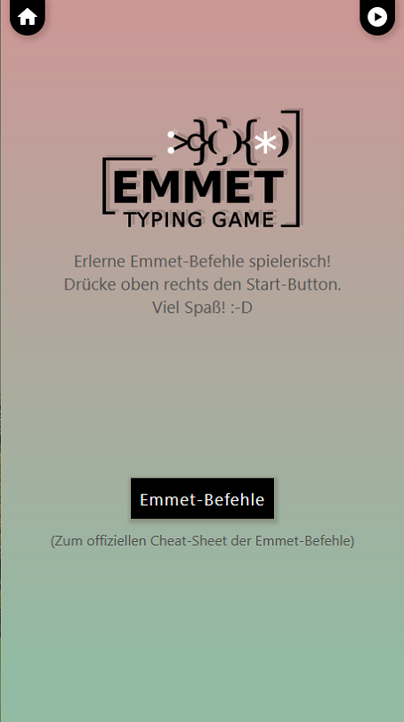
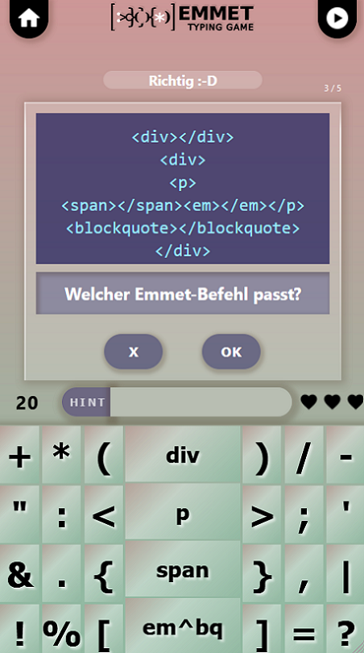
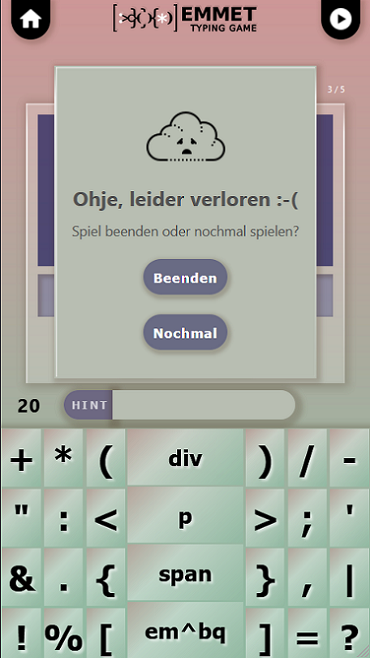

# Emmet Typing Game

This is a emmet typing game for mobile. It has the total innovative name "Emmet Typing Game" and a fancy ingame keyboard for easier access to necessary special characters.

## The Idea

Emmet expressions are a kind of shortcuts for code snippets of different languages like html, css, js etc. The use of them can boost your coding speed and productivity. But at first sight I thought they are looking confusing and unclear (especially the long ones). So I thought it would be useful to have a little game to practice them.

## Project Background

Originally this project had started as capstone project of a web developer bootcamp I attended in March 2020. The task was to build a little mobile app in react.js. The project idea was totally free.

## Used Programming Technologies

Main technology is React.js. In detail you find the usage of 
 - Functional programming as basic concept
 - JSX (styled components)
 - Reach router navigation
 - Props
 - State hooks

 ## Screenshots
 |          Start area           |             In game view              |       Game Over          |
| :----------------------------: | :------------------------------: | :------------------: |
|  |   |  |

 
## Planned Improvements
- Syntax highlighting
- Adding more then 20 questions in the game
- Little animations for life and score counter

## Finished Improvements
- Delete Button for single characters for mobile screen size
- Desktop version, where you can use your hardware keyboard
